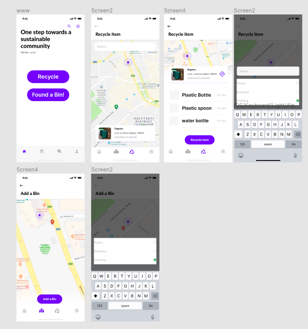

# PintoBin (ElleHacks 2021)

## Idea Pitch
Making recycling easier as a community! This app encourages users in the community to use the recycling bin located around their area by searching the existing recycling bins created by other users.

## Idea Description
To encourage individuals to build habits that will lead to a more sustainable community, this app will create a sense of community in putting recycling efforts. The users will be able to add recycling bins on a map, in which other users can view it and be informed of the bins around the area. Since the database is built by the users in the area, using this app can make the individual feel much closer to the community.

## Demo

## Website

Website: 
https://alinac16.github.io/PintoBin/

## Authors and acknowledgment
Michelle Paradis, Alina Chalanuchpong, Doris Zhou

## Technologies used

HTML, CSS, JavaScript, Firebase, MapBox API

## What motivated you to go with this project?
 
## How impactful is your innovation?

## What is your envisioned solution?

## Do you have any designs?

## What is the potential for impact of the idea?
