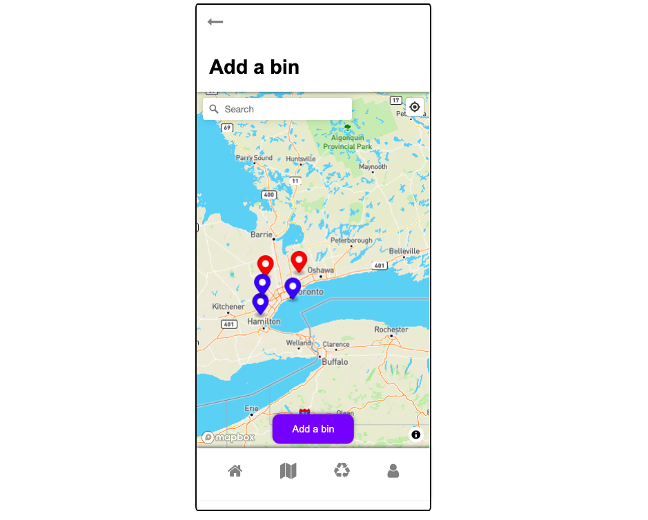

# PintoBin (ElleHacks 2021)

## Challenge
Create a tool that helps people understand climate change and how it affects them personally, instead of the entire planet. The tool could help people make changes to their lifestyle, mobilize action or could even be an educational tool.

## Who is your target audience?
People of all ages who want to recycle but find it difficult to start.

## How does your product satisfy the challenge criteria?
As temperature hits a new high in 2020, we must ask ourselves, what can we do to help combat climate change? As we all know, recycling helps reduce carbon emission and eliminate plastic pollution. However, according to statistics, only 9% of all recyclables have ended up being recycled. It is of vital importance for us to build a habit of recycling and make recycling even easier for everyone. Our product encourages recycling and makes it enjoyable and easy!

## What's unique about your solution? 
Unlike other recycling apps, our service is community-based, leading to more collaboration between users. This does not only enhance a sense of community and belonging, but also encourages users to come back and contribute more. In a sense, the pinned locations are a product of community collaboration.

## Idea Pitch
Making recycling easier as a community! This app encourages users in the community to use the recycling bin located around their area by searching the existing recycling bins created by other users.

## Idea Description
Simply load the app and see all the recycling bins/centers near you! Not only can you browse through all the recyclings, but you can also contribute by adding additional unmarked bins for other users.

To encourage individuals to build habits that will lead to a more sustainable community, this app will create a sense of community in putting recycling efforts. The users will be able to add recycling bins on a map, in which other users can view it and be informed of the bins around the area. Since the database is built by the users in the area, using this app can make the individual feel much closer to the community. The users will also have the opportunity to become fact-checker and enhance our community by correcting any erroneous or out-dated recycling information submitted by community members.

All users earn points by adding a bin to our map. Frequent users that contribute accurate data will become SuperUsers who lead others to a more recycling-conscious lifestyle.

## Demo

Link: https://youtu.be/Zv1Hv2TMXPY

## Website

Website: 
https://alinac16.github.io/PintoBin/

## Authors and acknowledgment
Michelle Paradis, Alina Chalanuchpong, Doris Zhou

## Technologies used

HTML, CSS, JavaScript and jQuery, Firebase, MapBox API

## What motivated you to go with this project?

As temperature hits a new high in 2020, every one of us should ask ourselves, what can we do to help combat climate change? As we all know, recycling help reduce carbon emission and eliminate plastic pollution. However, according to statics, only 9% of all recyclables have ended up being recycled. It is of vital importance for us to build a habit of recycling and make recycling even easier for everyone. All the available recycling information in Toronto has not been made centralized or accessible. The lack of a user-friendly platform has become a hurdle for people to find the right location to drop off their recyclables. We thought our app could be a perfect solution to the recycling difficulties.

## How impactful is your innovation?
The innovation impacts a large group of communities. Our creation not only makes recycling easy and enjoyable. It but also establishes a community that helps each other become more environmentally friendly.

## What is your envisioned solution?
A mobile app that has allows users to browse through all recycling bins near their location. A user will be prompted to fact-check each bin created by a community member. A user can choose to share their current location or use the search bar to locate nearby recycling bins. A user can easily add a recycling bin missing on our map. All submissions will go through a checking system before being published for a larger audience. An image recognition function allows users to easily identify if the object is recyclable.

## Do you have any designs?

## What is the potential for impact of the idea?
If our product reaches a large enough audience, it can encourage sustainability and make a difference by reducing the carbon footprint. Additional features such as recycling categorization by image recognition will help educate users and make sure all recyclables get recycled.
